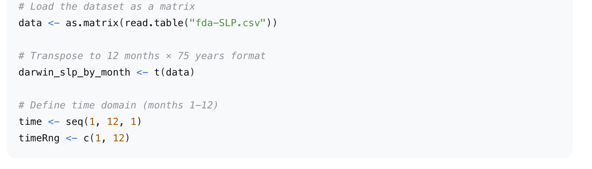
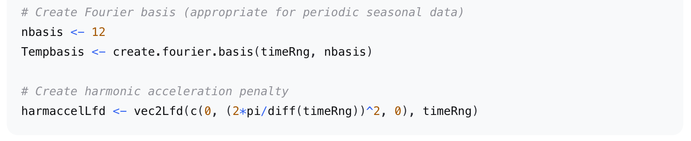
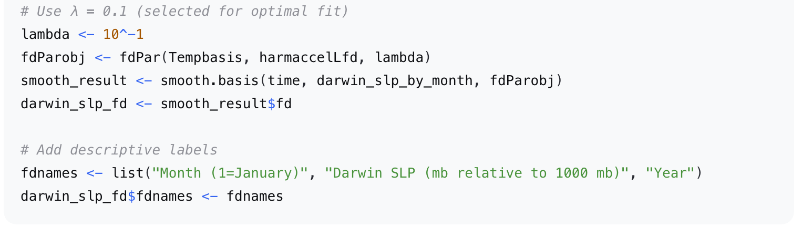
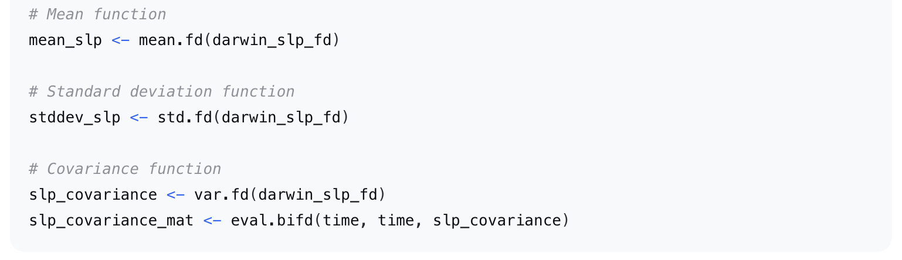
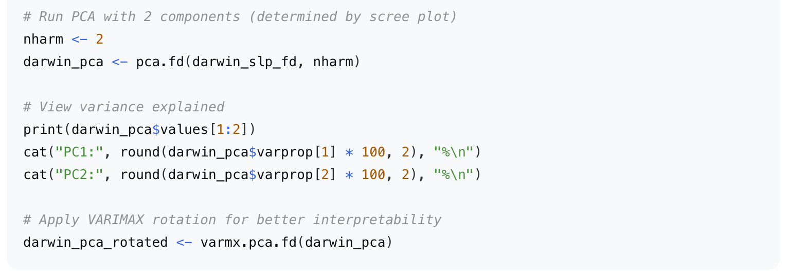
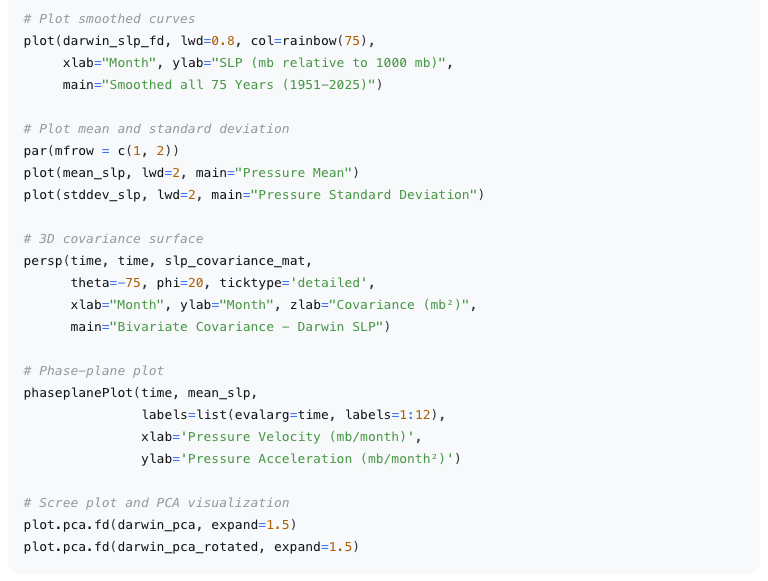

# Functional Analysis of Darwin Sea Level Pressure (1951-2025)

📋 Overview  
This project applies Functional Data Analysis **(FDA)** techniques to analyze 75 years (1951-2025) of monthly Darwin Sea Level Pressure (SLP) data. The analysis transforms discrete monthly observations into continuous functions to study **seasonal patterns, interannual variability, and ENSO-related pressure anomalies**.

##  🎯 Key Objectives
- Convert discrete SLP measurements into smooth functional curves using Fourier basis functions
- Compute and interpret functional descriptive statistics (mean, standard deviation, covariance)
- Perform Functional Principal Component Analysis (FPCA) to identify dominant modes of variation
- Apply VARIMAX rotation to enhance the physical interpretability of principal components

## 📊  Dataset
- Source: Darwin, Australia sea level pressure records
- Time Period: 1951 - 2025 (75 years)
- Resolution: Monthly observations (12 months per year)
- Format: 75 rows × 12 columns matrix (years × months)
- Units: mb relative to 1000 mb

## 🚀 Getting Started

### 1. Clone the Repository
- git clone https://github.com/yourusername/darwin-slp-fda.git
- cd darwin-slp-fda
### 2. Launch R or RStudio
Open RStudio or your preferred R environment.
### 3. Install Required Package & Load fda Library
- install.packages("fda")
- library(fda)
### 4. Read and Prepare the Data

### 5. Set Up Fourier Basis for Smoothing

### 6. Perform Smoothing with Chosen λ

### 7. Compute Functional Statistics

### 8. Perform FPCA

### 9. Generate Visualizations

## 📈 Key Findings
- Seasonal Pattern: Low pressure (7-8 mb) in January-April; high pressure (12-13 mb) in July-August
- Interannual Variability: Highest variability during austral summer (August-February) ~1 mb; lowest during winter (June-September) ~0.75 mb

- FPCA Results (Unrotated):
  - PC1 explains 53.34% of variation (overall pressure anomalies/ENSO signal)
  - PC2 explains 26.37% of variation (summer-winter contrast)

- FPCA Results (VARIMAX Rotated):
  - PC1 explains 50.27% (summer ENSO signal)
  - PC2 explains 29.44% (winter monsoon signal)

## 📝 Methodology Highlights
- Smoothing Parameter Selection: GCV suggested λ = 1, but λ = 0.1 was chosen for better fit (RMS residual 0.84 vs 0.94)
- Basis Functions: Fourier basis used due to periodic nature of seasonal SLP data
- Phase-Plane Analysis: Revealed harmonic circular trajectory, confirming strong annual periodicity
- VARIMAX Rotation: Successfully separated summer ENSO signal from winter seasonality for cleaner physical interpretation

## ⚠️ Notes
- The analysis uses SLP values relative to 1000 mb (e.g., 5.3 means actual pressure of 1005.3 mb)
- Fourier basis with 12 basis functions provides adequate flexibility for monthly data
- VARIMAX rotation does not change total variance explained, only redistributes it for interpretability

## 📚 References
- Ramsay, J. O., & Silverman, B. W. (2005). Functional Data Analysis (2nd ed.). Springer.
- fda R package documentation

## 📅 Date
- April 2026

## 👨‍💻 Author
Sanjib Samadder | Data Scientist

## 📖 License
This project is for academic purposes. Please cite appropriately if using the code or methodology.

### Happy Analyzing! 📊

